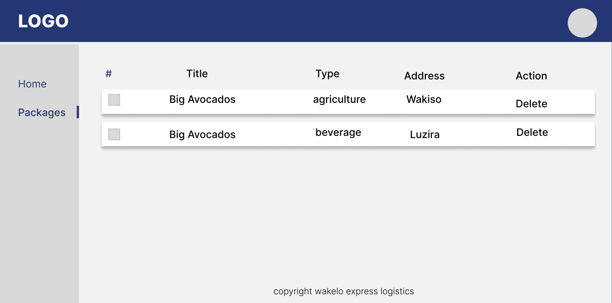

## Instructions
Please stick to the following instructions on how to submit your application:
1. Read the whole README
2. Fork our repository
3. Add your solution to your repository
4. Create a pull request to our repository
5. Add Screen shots to your Pull Request
6. Attach a documentation of what you would do given more time

Also note down in the end how many hours it took to complete (roughly). **Please do not spend more than 6 hours for the whole task.**

Thank you very much!

## Main Task
You are developing a new dashboard. Your task is to create a new dashboard with which you will be displaying package information following

First you have to setup the main dashboard with the main structure:
- Header with [Wakelo logo](logo.png)
- Navigation
  - Main Page(Home)
  - Packages

This structure will be the same on all pages

It's not required that the main page has any content. **But it should be the default page on the root path `/`.**

### Package Page (`/package`)
- Package main info should contain
  - title
  - Address
  - type 

### Example Mockup

## Technical Requirements

The application should at the very least use the following:

- React.js framework
- Redux or Built-in React state management hooks
- CSS
  - Your own CSS structure
  - **Do not** use any CSS frameworks (e.g Bootstrap)
  - A CSS pre-compiler (SASS, LESS, SCSS) or other CSS approaches (CSS modules, Styled components)
- The dashboard should be responsive. It should **be usable on mobile and tablets**. There are no mockups for mobile and table views, adapt it to your taste.

When styling, you can decide for yourself what this dashboard should look like (even the structure-wise), make it look as nice as you can.

## Bonus
Bonus points are awarded if the styles resemble those of [wakelo](https://wakeloexpress.com/) and could fit as seamlessly as possible within that website.
Other points that are optional but give additional credit:
  - Comment your code where necessary
